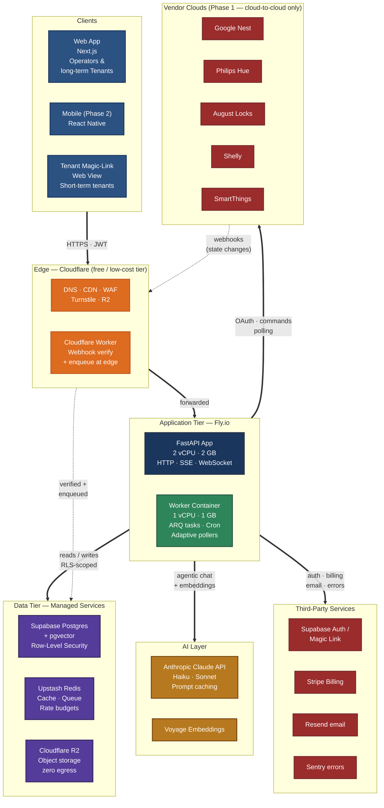
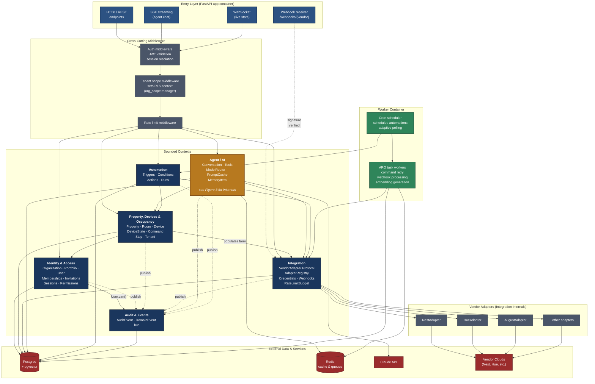
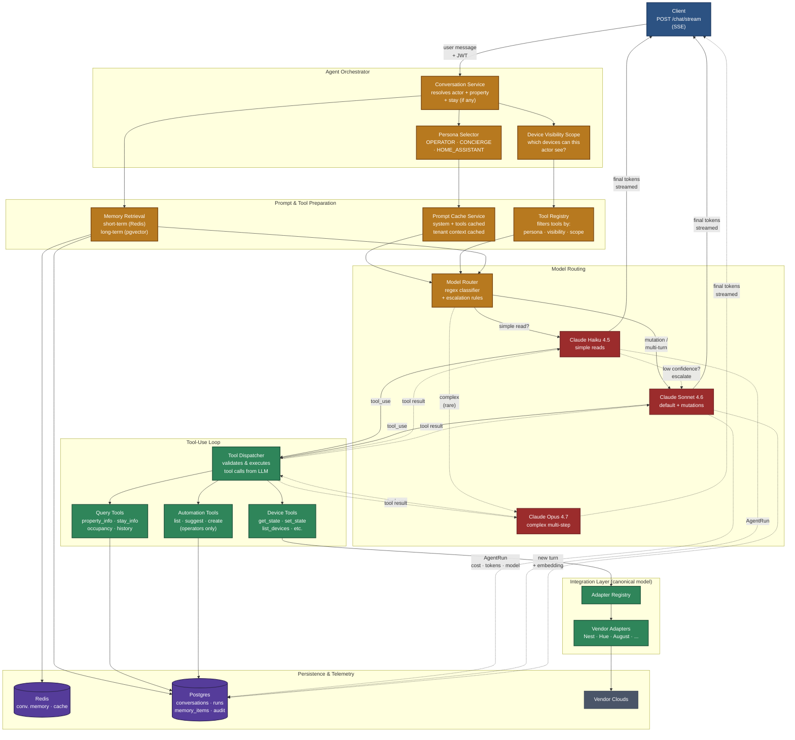
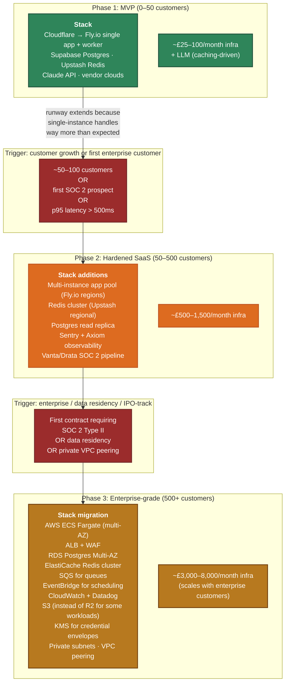

# AlphaCon AI — Architecture Reference (v1.0)

*Component and deployment view. Companion to the v1.1 class diagrams. Where the class diagrams show **what** the system is, this document shows **where the code runs and what talks to what**.*

---

## What this document covers

Four diagrams, in order from physical to logical to detailed to forward-looking:

1. **Phase 1 deployment** — the physical view: what runs where, on which cloud, how requests flow.
2. **Component diagram** — the logical view: how the FastAPI application is structured internally.
3. **Agent flow** — zoomed into the AI layer: tool-use loop, model routing, prompt caching, memory.
4. **Scaling evolution** — what changes as we grow from MVP to enterprise.

Use this document alongside:
- The **class diagrams (v1.1)** — for the data model and bounded contexts
- The **glossary** — for vocabulary
- The **architecture-first rationale** — for the "why architecture before code" defence

---

## 1. Phase 1 Deployment

The physical view of where everything runs in the MVP. Read top-to-bottom: clients hit Cloudflare, Cloudflare forwards to Fly.io, Fly.io reads/writes to managed data services, calls Claude for AI, and talks to vendor clouds for device control. Webhooks come back from vendors via Cloudflare's edge for signature verification before hitting the queue.

### Key choices and the reasoning

**Cloudflare at the edge** — DNS, CDN, WAF, Turnstile (anti-abuse), and R2 (object storage with zero egress fees). Free or near-free at our scale. The Cloudflare Worker layer verifies vendor webhook signatures and enqueues them before they ever hit our origin, saving compute and reducing attack surface.

**Fly.io for the application tier (MVP)** — One FastAPI container plus one worker container handles thousands of req/s on async Python. No load balancer, no Lambdas, no Kubernetes. £10–25/month per container. Multi-region capable when we need it. Migrates cleanly to AWS ECS Fargate when SOC 2 / data residency requirements appear.

**Supabase Postgres + pgvector** — Managed Postgres with built-in auth, generous free tier, scales to a paid plan smoothly. pgvector for embeddings means we don't need a separate vector database. Row-Level Security policies enforce tenant isolation at the database layer, so even an application bug cannot leak data across customer accounts.

**Upstash Redis (serverless)** — Pay-per-request, free tier covers MVP, no provisioning. Holds short-term agent memory, rate-limit budgets per vendor per organisation, and the queue that decouples webhook receipt from webhook processing.

**Cloudflare R2 for object storage** — Zero egress fees. Property photos, exports, audit log archives. S3-compatible API; migrates trivially if we ever need to.

**Cloud-to-cloud integration only (Phase 1)** — We talk to Nest, Hue, August, etc. via their cloud APIs. No on-premise gateway, no Zigbee/Z-Wave/Matter stack, no local agent to install. This is what enables the "5-minute onboarding" promise. Hardware comes in Phase 3 as a deliberate product expansion, not a Phase 1 requirement.

**Claude with prompt caching and model routing** — The single biggest infrastructure cost decision. Without prompt caching, the LLM bill at MVP scale is £1,200–1,600/month. With caching plus Haiku/Sonnet routing, it drops to £100–200/month. This is built in from day one, not bolted on later.

---

## 2. Component Diagram (Inside the FastAPI App)

The logical view of how the application is structured. Same six bounded contexts as the class diagrams, plus the entry layer (HTTP/SSE/WebSocket/webhook receivers), the cross-cutting middleware (auth, tenant scope, rate limiting), the worker container, and external services.

The Agent context is highlighted in **orange** because its internals are detailed in the next diagram.

### How a request flows through this

For a typical authenticated API call:

1. **Entry** — the request arrives at the FastAPI app via HTTP (a REST call), SSE (an agent chat), or WebSocket (a live state subscription).
2. **Auth middleware** validates the JWT, resolves the User, and sets the active Organisation on the request.
3. **Tenant scope middleware** opens a database transaction and sets the `app.current_organization_id` Postgres setting that drives Row-Level Security. Every query inside this request scope is automatically isolated to this Organisation's data.
4. **Rate limit middleware** checks per-User and per-IP limits.
5. The request is routed to the relevant bounded context. The context performs its work, possibly calling other contexts through their public interfaces.
6. **Domain events** are published to the audit log and to in-process subscribers (the automation engine, the websocket pusher).
7. The response streams back.

Webhooks bypass the auth middleware (they're vendor-originated) and instead hit the Integration context's webhook receiver after Cloudflare Worker has verified the vendor signature. The webhook payload is enqueued in Redis and processed by the worker container — never synchronously, because vendor APIs have aggressive timeouts on our acknowledgement.

### Why the agent is highlighted

The Agent context has more internal moving parts than the others — model routing, prompt caching, tool dispatch, memory retrieval, persona switching. Detailing all of that on this diagram would obscure the bigger picture. Diagram 3 zooms in.

---

## 3. Agent Flow (The AI Layer in Detail)

The internal flow of the Agent context. Starts when a client posts a message to `/chat/stream` and ends when the final tokens are streamed back.

### Walking through a request

Step-by-step for a Tenant asking "what's the wifi password?":

1. **Conversation Service** receives the message and resolves: who's asking (Jo, the Tenant), where (Cottage 3), in what context (her active Stay).
2. **Persona Selector** picks `CONCIERGE` (she's a short-term Tenant).
3. **Device Visibility Scope** computes which Devices Jo can see — only Cottage 3's Property-owned devices within her scope, plus any she personally owns.
4. **Tool Registry** filters the tool catalog: she gets `query.property_info`, `query.stay_info`, `device.get_state`, `device.set_state` (within scope) — but not `automation.create` or any device outside Cottage 3.
5. **Memory Retrieval** pulls recent conversation turns from Redis and any relevant property notes from pgvector.
6. **Model Router** classifies the query: simple read → Haiku.
7. **Prompt Cache Service** assembles the prompt with cached system prompt, cached tool catalog, cached tenant context, plus the fresh memory and message.
8. **Claude Haiku** receives the prompt, calls `query.property_info` for wifi credentials, gets the result, and generates a friendly response.
9. **Final tokens** stream back to Jo via SSE.
10. **AgentRun** is recorded with cost (~£0.003), tokens, model, latency. Conversation turn is persisted with an embedding.

For a more complex query — "pre-heat the cottage to 21°C 2 hours before our friends arrive at 5pm tomorrow" — the same flow runs but: (a) the Router picks Sonnet because it's a multi-step mutation involving an automation, (b) the tool-use loop iterates several times (lookup property timezone, check current thermostat scope, propose the automation, get confirmation), and (c) the AgentRun records the higher cost.

### What this gets right

**Tool catalog filtering happens before Claude sees the tools.** Jo cannot trick the agent into unlocking the front door because the lock tool is not even in her tool catalog. Security by invisibility, not refusal-after-the-fact.

**Persona changes the personality and the available actions, not just the wording.** A `CONCIERGE` agent answering Jo gets a friendly tone and a narrow tool catalog. An `OPERATOR` agent answering Sarah gets a precise tone and the full operations toolkit. Same Claude, same prompt cache, different filters.

**Cost is measured per-run, not per-conversation.** A Conversation can produce many AgentRuns (escalation, tool-use loops). Tracking cost at the run level gives accurate per-Tenant, per-Stay, per-Org cost attribution — which we'll need to make the £99/£299/£1,499 tiers profitable.

**The Tool Dispatcher is where authorisation actually executes.** Even if a tool is in the catalog, the Dispatcher validates that the actor has authority over the target Device at execution time. This is defence in depth: filtering at the catalog level, validation at execution.

---

## 4. Scaling Evolution

The Phase 1 deployment is deliberately minimal. As the product grows, the architecture evolves through three phases driven by specific triggers — not by guesswork or fashion.

### What this is and isn't

This is a **migration plan**, not a roadmap. We don't move to Phase 2 because "it's been a year." We move when one of the listed triggers actually fires. Until then, Phase 1's single-container deployment handles the load — async FastAPI on a 2 vCPU box serves thousands of req/s, and our real bottleneck at MVP scale will be vendor API rate limits, not our own infrastructure.

The **Phase 3 migration to AWS** is a deliberate, large piece of work — typically a fundraising milestone or an enterprise-customer milestone. We don't pre-build for it; we *design for migrability* (managed Postgres → RDS is straightforward, Cloudflare R2 → S3 is straightforward, Fly.io containers → ECS Fargate is a deployment-pipeline change, not a code rewrite).

The **costs are infrastructure only**. LLM costs scale linearly with usage and are the dominant variable cost throughout. Prompt caching and Haiku routing keep them in proportion at every phase.

---

## How this document relates to the others

| Document | What it answers |
|---|---|
| **Class diagrams (v1.1)** | What are the things in the system and how do they relate? |
| **Glossary** | What does each term mean in plain English? |
| **Actors guide** | Who are the people in the system, and what can each one do? |
| **Architecture-first rationale** | Why are we designing before building? |
| **This document** | Where does the code run, and what talks to what? |

Read together, these five documents constitute the Phase 1 technical foundation. Anyone joining the engineering team should read them in roughly this order: glossary → actors guide → class diagrams → this document → rationale.

---

## Versioning

- **v1.0** *(this document)* — Phase 1 deployment, components, agent flow, scaling evolution.
- v1.1 will add sequence diagrams for critical flows (OAuth onboarding chain, webhook ingestion path, tenant magic-link flow, automation runner).
- v2.0 only when something structural changes — e.g., Phase 2 actually triggers and we evolve the production deployment.