# AlphaCon AI — Phase 1 MVP Class Diagrams (v1.1)

*Canonical class diagram pack. Supersedes v1.0 and all earlier versions. Reflects the decoupled Device model: Devices and Integrations are first-class aggregate roots with polymorphic ownership (Property or Tenant).*

*Renders as Mermaid in any modern markdown viewer (GitHub, GitLab, Notion, IntelliJ, VS Code with Mermaid plugin, Obsidian).*

---

## What's new in v1.1

The single foundational change: **Devices and Integrations are no longer subordinate to Properties.** Both are first-class aggregate roots with polymorphic ownership.

| Concept | v1.0 | v1.1 |
|---|---|---|
| Device parent | Always a Property (`property_id` FK) | Owner is either a Property *or* a Tenant (polymorphic) |
| Device location | Implicit (= Property) | Separate `current_property_id` field, can be null |
| Integration parent | Always a Portfolio | Owner is either a Property/Portfolio *or* a Tenant |
| Bounded context name | "Property & Occupancy" | "Property, Devices & Occupancy" |
| Tenant-owned smart home | Not modelled | First-class — Tenants bring their own Hue/Nest accounts and devices |

This is the right architecture from the start, not a phased upgrade. v1.0 is dead.

---

## Design Conventions

**UML stereotypes:**

| Stereotype | Meaning |
|---|---|
| `<<aggregate root>>` | Entry point to a consistency boundary. External code only references aggregate roots, never their internals. |
| `<<entity>>` | Has identity, lives inside an aggregate. |
| `<<value object>>` | Immutable, no identity, equality by value. |
| `<<interface>>` | Contract that implementations must realize. |
| `<<adapter>>` | Concrete implementation of a vendor adapter interface. |
| `<<enumeration>>` | Closed set of constants. |
| `<<service>>` | Stateless behaviour that doesn't naturally belong to any entity. |
| `<<abstract>>` | Cannot be instantiated directly. |
| `<<polymorphic>>` | Owner is one of multiple aggregate root types — distinguished by an `owner_type` enum. |

**Relationship lines:**

| Symbol | Meaning |
|---|---|
| `*--` | Composition (lifecycle-bound; child cannot exist without parent) |
| `o--` | Aggregation (parent has child, but child has independent lifecycle) |
| `-->` | Directed association (knows about) |
| `..>` | Dependency (uses transiently) |
| `..\|>` | Realization (implements interface) |
| `<\|--` | Inheritance |

**Multiplicity:** standard UML — `1`, `*` (many), `0..1` (optional), `1..*` (one or more).

---

## The conceptual hierarchy

The four-level hierarchy from v1.0 is unchanged. What changes is how Devices and Integrations attach to it.

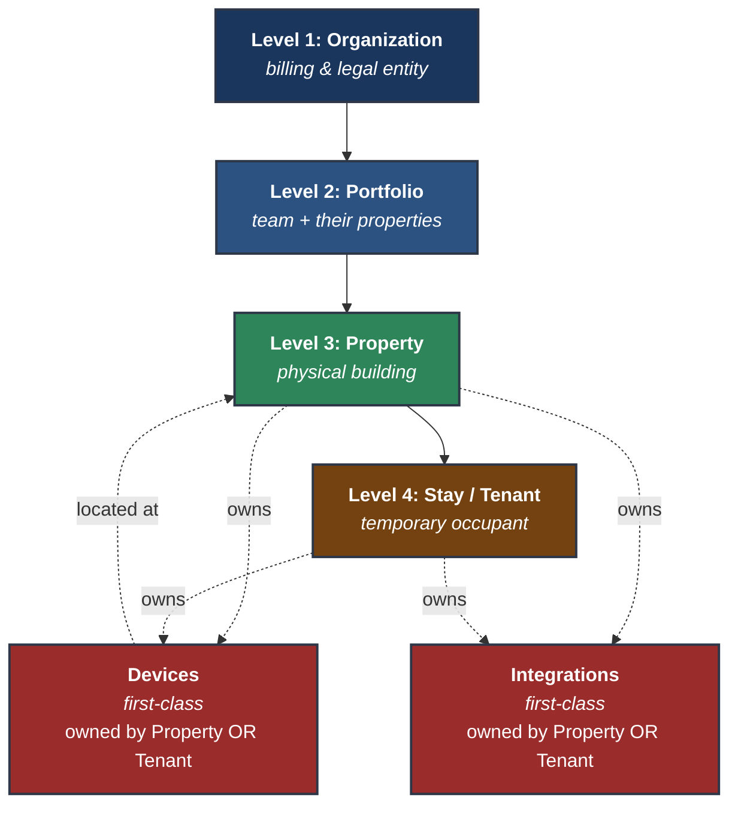

Key insight: **Devices and Integrations sit *alongside* the hierarchy, not inside it.** Their owner is one node from the hierarchy (either a Property or a Tenant), but they're not children of any one node.

---

## Bounded Context Map

Six bounded contexts. The Property & Occupancy context from v1.0 is renamed to **Property, Devices & Occupancy** to reflect Device's promotion to first-class status.

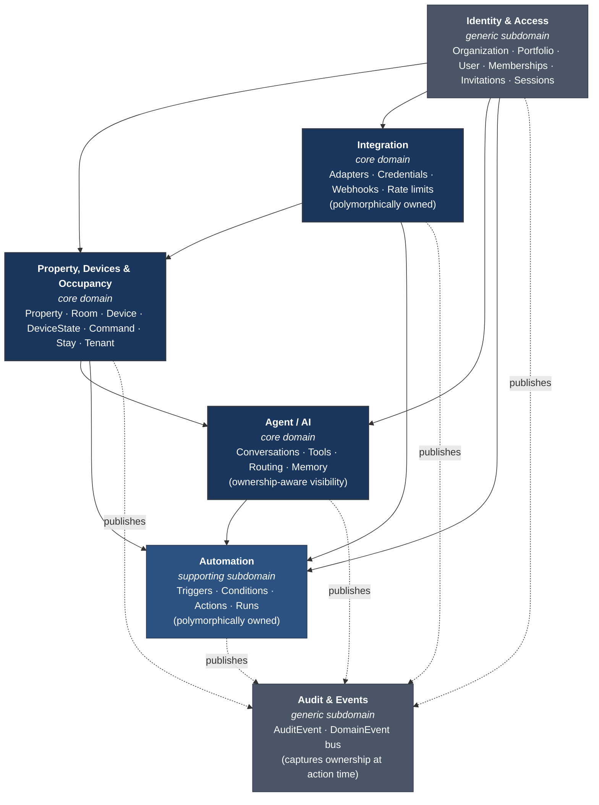

---

## 1. Identity & Access

Unchanged from v1.0. Same four-level access hierarchy with Memberships and Property Assignments. (Reproduced here for completeness — if you're already familiar, skip to context 2.)

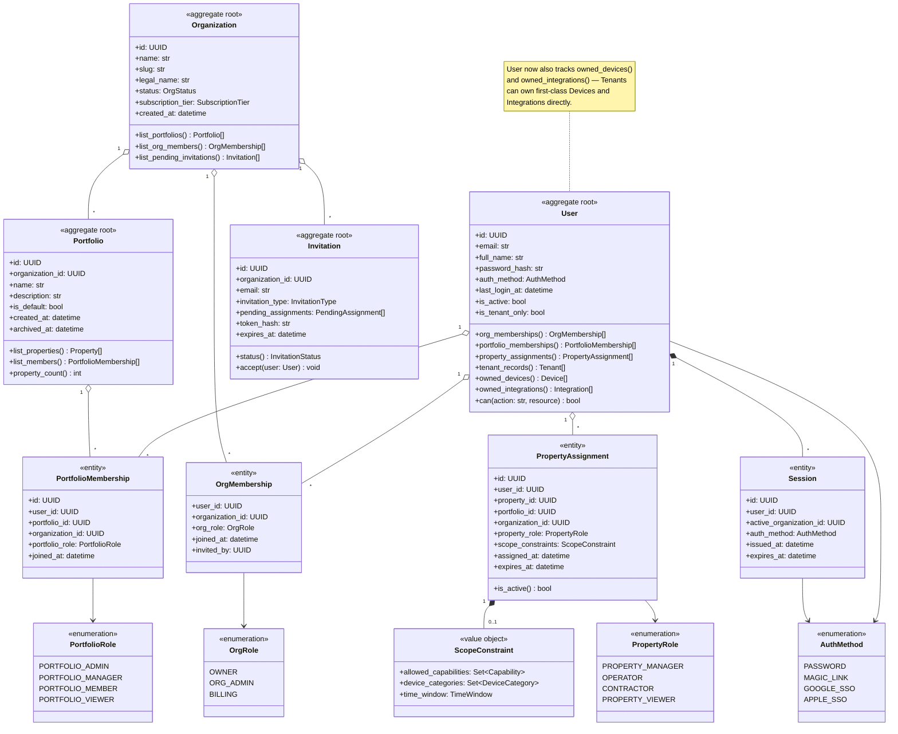

---

## 2. Property, Devices & Occupancy

Core domain. Renamed from v1.0's "Property & Occupancy" because Device is now too significant to be hidden in a sub-bullet of the name. Three sub-models live here: **Property** (physical container), **Device** (first-class, polymorphically owned), and **Stay/Tenant** (occupancy).

### 2a. Property and Rooms

Property is now a clean entity — it has Rooms, hosts Stays, and is *physically referenced by* Devices via `current_property_id`. It does not own Devices in the parent-child sense.

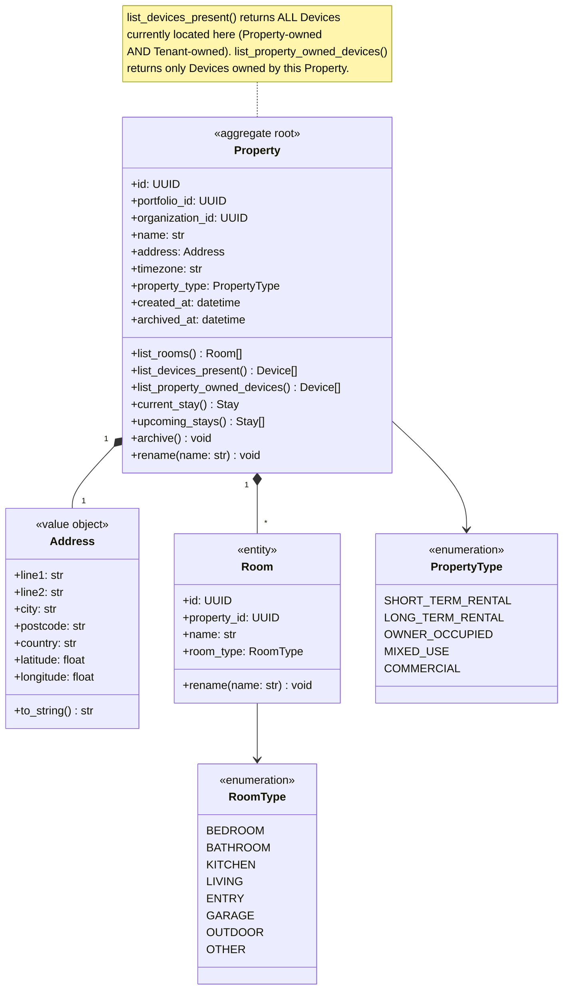

### 2b. Device (first-class, polymorphic owner)

This is the heart of the v1.1 change. Device is now an aggregate root with two distinct relationships: an owner (polymorphic) and a current location (the Property it physically sits in).

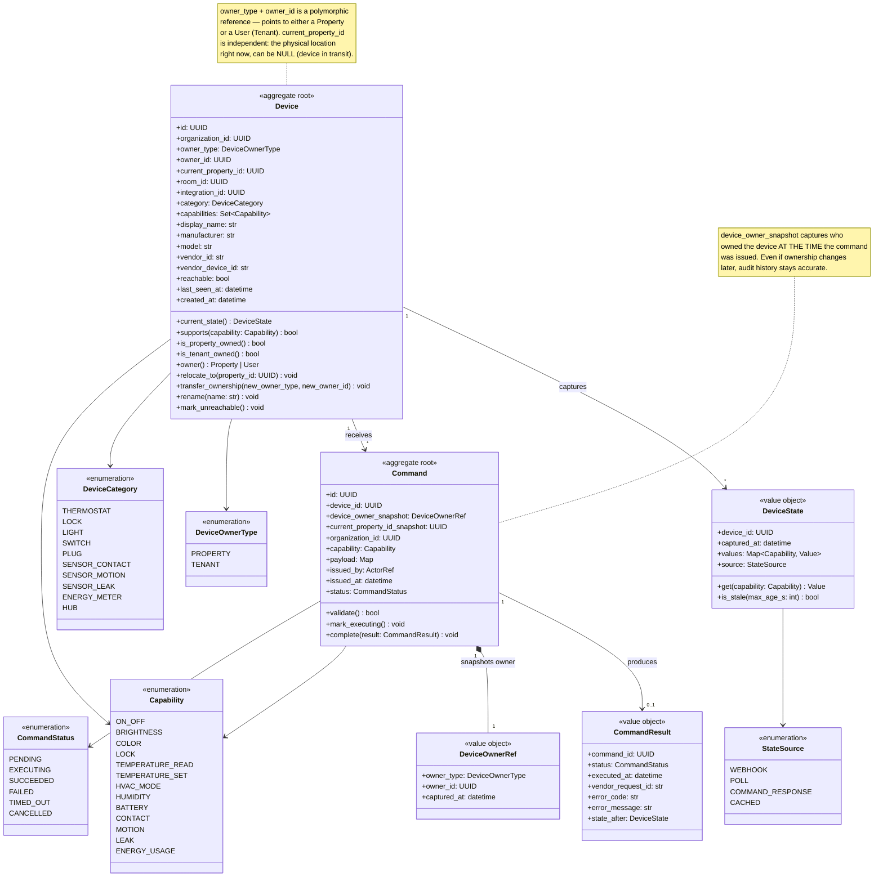

**Key decisions:**

- **Polymorphic owner**: `owner_type` discriminates between PROPERTY and TENANT. The `owner_id` field holds either a Property's UUID or a User's UUID. The `owner()` method resolves to the right entity.
- **Current location is separate from ownership.** A Tenant-owned Device has `owner_id = the Tenant's User ID` permanently, but `current_property_id` updates if the Tenant moves to a different AlphaCon Property.
- **Current location can be NULL.** Tenant-owned Devices between rentals have no current Property — that's a valid state, not an error.
- **Commands snapshot ownership at issue time.** Even if a Device's ownership changes later (rare but possible — a Tenant gifts their Device to the Property when they leave), audit history shows who owned it when each command was issued.
- **Org ID is on Device.** This is critical for RLS — even Tenant-owned Devices carry the Organization ID of the Property they're currently located in, so isolation works cleanly. When a Tenant moves between Organizations (e.g., from one property management company to another that also uses AlphaCon), the org_id updates with the location.

### 2c. Stay and Tenant

Stays and Tenants are largely unchanged from v1.0, except Tenants now explicitly can own Devices and Integrations (visible via `User.owned_devices()` and `User.owned_integrations()` from the Identity context).

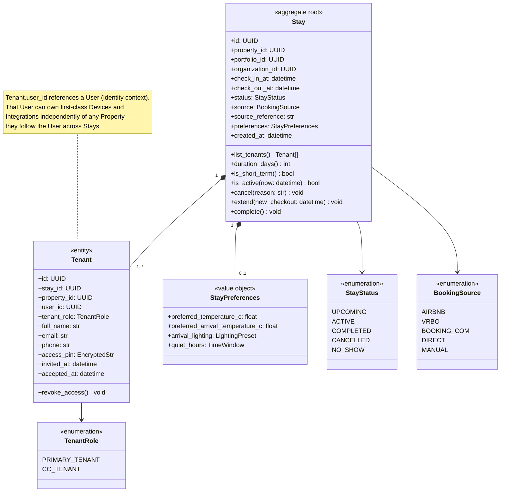

### 2d. The full Property/Device/Stay relationship

Putting it all together — how Property, Device, Stay, and Tenant relate in v1.1:

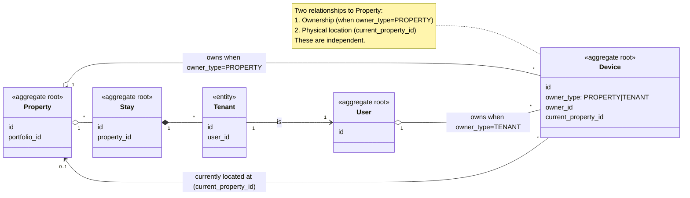

---

## 3. Integration

Same polymorphic-owner pattern as Device. An Integration is a vendor connection that's owned by either a Property/Portfolio (host's vendor account) or a Tenant (their personal vendor account).

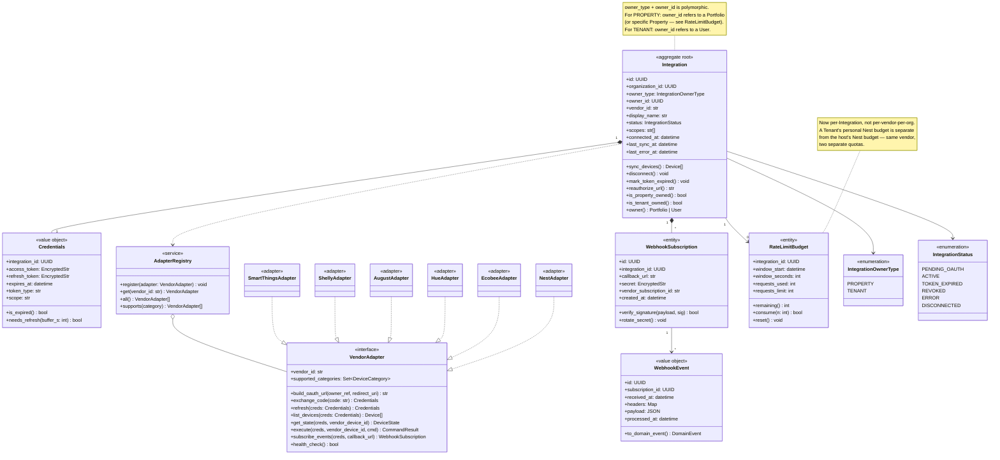

**Key decisions:**

- `Integration.owner_type` mirrors `Device.owner_type`. Same polymorphic pattern.
- For PROPERTY-owned Integrations, the owner is a Portfolio (because Integrations are typically scoped to a team/region, not a single building). A Portfolio's Nest account discovers devices that get assigned to specific Properties within the Portfolio.
- For TENANT-owned Integrations, the owner is a User. When the Tenant disconnects or their Stay ends, the Integration and all its Devices are removed.
- `RateLimitBudget` is now per-Integration, not per-vendor-per-org. A Tenant's personal Nest API quota is tracked separately from the host's, even though they're both calling Nest.
- Same `VendorAdapter` interface serves both ownership types. The Adapter doesn't know or care who owns the Integration — it just authenticates with whatever credentials it's given.

### Adapter error hierarchy (unchanged from v1.0)

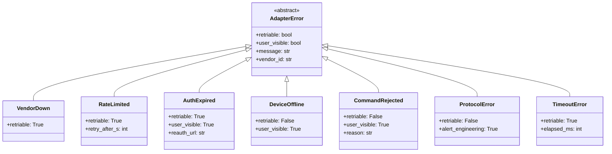

---

## 4. Agent / AI

Updated for ownership-aware Device visibility. The agent's tool catalog is filtered by what Devices the actor can see, not just by their role permissions.

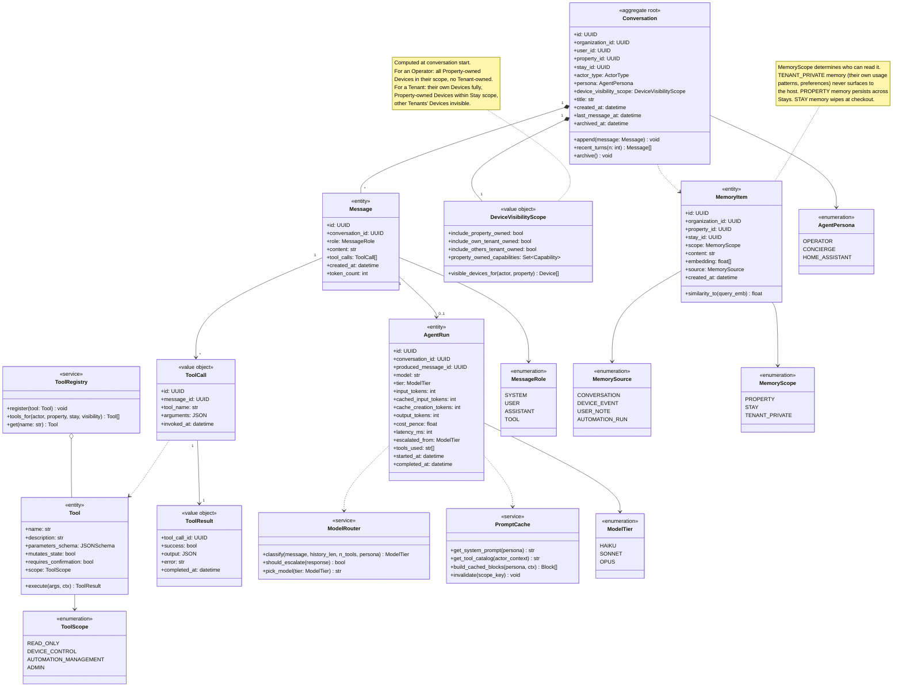

**Key decisions:**

- **`DeviceVisibilityScope` is a new value object** computed at conversation start. It encodes "what Devices does this actor see, and what can they do with each." Persists for the conversation — every tool call inside the conversation respects the same scope.
- **The agent never even sees Devices outside its scope.** A Tenant talking to the agent doesn't get Devices owned by other Tenants in their tool catalog. Claude doesn't know they exist. This is enforcement by *invisibility*, not by *refusal*.
- **`MemoryScope` separates Tenant-private memory from Property memory.** A long-term Tenant's usage patterns ("David likes the bedroom at 18°C, lights off by 11pm") are scoped TENANT_PRIVATE — never available to the host's queries about the Property.

---

## 5. Automation

Updated to support polymorphic ownership: an Automation is owned by either a Property (host's automations, persist across Stays) or a Tenant (Tenant's automations, scoped to their Stay).

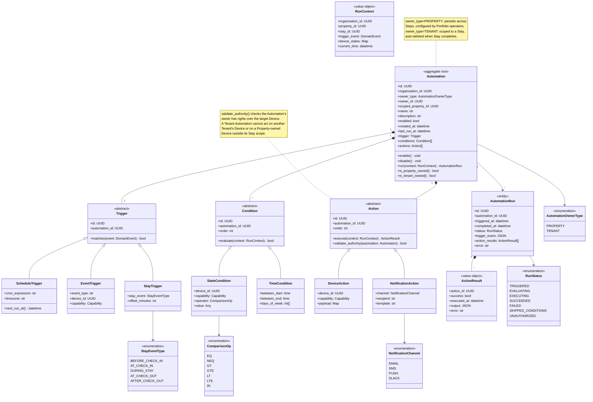

**Key decisions:**

- Tenant-owned Automations were deferred in v1.0 — in v1.1 the schema supports them, MVP can ship with creation restricted to Portfolio operators if you want to keep scope tight, and unlock Tenant-created automations in 1.5 by lifting that restriction. No schema migration needed.
- `Action.validate_authority()` is the runtime check that an automation's owner has rights over the target Device. Tenant automations can only target their own Devices and Property-owned Devices within their Stay scope.

---

## 6. Audit & Domain Events

Updated to capture Device ownership at action time, plus new ownership-related domain events.

```mermaid
classDiagram
    direction TB

    class AuditEvent {
        <<entity>>
        +id: UUID
        +occurred_at: datetime
        +organization_id: UUID
        +portfolio_id: UUID
        +property_id: UUID
        +actor: ActorRef
        +action: str
        +resource_type: str
        +resource_id: str
        +resource_owner_snapshot: ResourceOwnerRef
        +metadata: JSON
        +ip_address: str
        +user_agent: str
    }

    class ActorRef {
        <<value object>>
        +type: ActorType
        +id: str
        +display_name: str
        +on_behalf_of: ActorRef
        +acting_role: str
    }

    class ResourceOwnerRef {
        <<value object>>
        +owner_type: str
        +owner_id: str
        +owner_display_name: str
    }

    class DomainEvent {
        <<abstract>>
        +id: UUID
        +organization_id: UUID
        +occurred_at: datetime
        +event_type: str
        +payload: JSON
    }

    class DeviceStateChanged {
        +device_id: UUID
        +device_owner: ResourceOwnerRef
        +current_property_id: UUID
        +previous_state: DeviceState
        +new_state: DeviceState
    }

    class DeviceOwnershipTransferred {
        +device_id: UUID
        +previous_owner: ResourceOwnerRef
        +new_owner: ResourceOwnerRef
        +reason: str
    }

    class DeviceRelocated {
        +device_id: UUID
        +previous_property_id: UUID
        +new_property_id: UUID
    }

    class CommandIssued {
        +command_id: UUID
        +device_id: UUID
        +device_owner: ResourceOwnerRef
    }

    class CommandCompleted {
        +command_id: UUID
        +result: CommandResult
    }

    class StayCreated {
        +stay_id: UUID
        +property_id: UUID
    }

    class StayActivated {
        +stay_id: UUID
    }

    class StayCompleted {
        +stay_id: UUID
    }

    class IntegrationConnected {
        +integration_id: UUID
        +integration_owner: ResourceOwnerRef
        +vendor_id: str
        +device_count: int
    }

    class IntegrationDisconnected {
        +integration_id: UUID
        +reason: str
    }

    class AutomationTriggered {
        +automation_id: UUID
        +automation_owner: ResourceOwnerRef
        +trigger_event_id: UUID
    }

    class AgentInteractionCompleted {
        +conversation_id: UUID
        +run_id: UUID
        +cost_pence: float
    }

    class EventBus {
        <<service>>
        +publish(event: DomainEvent) void
        +subscribe(event_type, handler) Subscription
    }

    class ActorType {
        <<enumeration>>
        USER
        TENANT
        SYSTEM
        AGENT
        AUTOMATION
        VENDOR_WEBHOOK
    }

    DomainEvent <|-- DeviceStateChanged
    DomainEvent <|-- DeviceOwnershipTransferred
    DomainEvent <|-- DeviceRelocated
    DomainEvent <|-- CommandIssued
    DomainEvent <|-- CommandCompleted
    DomainEvent <|-- StayCreated
    DomainEvent <|-- StayActivated
    DomainEvent <|-- StayCompleted
    DomainEvent <|-- IntegrationConnected
    DomainEvent <|-- IntegrationDisconnected
    DomainEvent <|-- AutomationTriggered
    DomainEvent <|-- AgentInteractionCompleted
    AuditEvent "1" *-- "1" ActorRef
    AuditEvent "1" *-- "0..1" ResourceOwnerRef
    ActorRef --> ActorType
    AuditEvent ..> DomainEvent
    EventBus ..> DomainEvent

    note for AuditEvent "resource_owner_snapshot captures who<br/>owned the resource (Device/Integration/<br/>Automation) at action time. Distinguishes<br/>'David turned off his own light' from<br/>'David turned off the host's light'."
    note for DeviceOwnershipTransferred "Fires when a Device's ownership changes —<br/>e.g., a Tenant gifts their device to the<br/>Property when they leave. Drives downstream<br/>cleanup (memory rescoping, automation review)."
```

**Key decisions:**

- **`ResourceOwnerRef` snapshots** are critical for audit accuracy. Even if a Device's ownership transfers later, audit history shows what was true at the time of each action.
- **Three new domain events**: `DeviceOwnershipTransferred` (gifts/sales), `DeviceRelocated` (Tenant moves between properties), and the existing events now carry owner context.
- **The audit log can answer questions the v1.0 model couldn't**: "show me all actions David took on Property-owned Devices vs his own Devices" is a clean filter.

---

## 7. Cross-Context Aggregate Roots (Bird's Eye)

The minimum set of references that cross context boundaries.

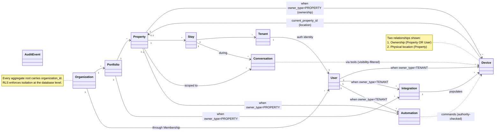

**The rule:** code in context A may hold `aggregate_b_id: UUID` referencing an aggregate in context B, but never directly imports B's internals. Context boundaries are crossed via repository lookups or domain events.

---

## RLS Implications of the Decoupled Model

Decoupling Devices and Integrations from strict Property hierarchy adds nuance to row-level security. Here's how it works cleanly:

```sql
-- Devices: visible to anyone who can see EITHER
--   (a) the Device's owner-Property (PROPERTY-owned), OR
--   (b) the Device's owner-User (TENANT-owned), if that User is the current session

CREATE POLICY device_isolation ON devices
USING (
    organization_id = current_setting('app.current_organization_id')::uuid
    AND (
        -- Property-owned: visible if user has access to the owner Property
        (owner_type = 'PROPERTY' AND owner_id IN (
            SELECT property_id FROM accessible_properties_for_current_user()
        ))
        OR
        -- Tenant-owned: visible to the owning User
        (owner_type = 'TENANT' AND owner_id = current_setting('app.current_user_id')::uuid)
        OR
        -- Tenant-owned: visible to host operators of the Property where it's located
        (owner_type = 'TENANT' AND current_property_id IN (
            SELECT property_id FROM accessible_properties_for_current_user()
        ) AND current_setting('app.current_user_role') IN ('PORTFOLIO_ADMIN', 'PORTFOLIO_MANAGER', 'PROPERTY_MANAGER'))
    )
);
```

The third clause is the privacy-aware host visibility: the host can see *that* a Tenant-owned Device exists in their Property, but separate column-level policies hide state and command history from them. The agent's `DeviceVisibilityScope` enforces stricter rules at the application layer for tool selection.

---

## What's Explicitly Out of Phase 1

| Deferred to | Concern |
|---|---|
| Phase 1.5 | Tenant-created Automations (schema supports it; restrict in MVP) |
| Phase 1.5 | `TENANT_VISITOR` role (let-a-friend-in-for-dinner case) |
| Phase 1.5 | Booking-platform integrations (Airbnb/Vrbo/Booking.com → Stay creation) |
| Phase 1.5 | Long-term Stay data portability (GDPR right-to-portability) |
| Phase 1.5 | Tenant-to-Property device gifting flow (when Tenant leaves device behind) |
| Phase 2 | `Camera` device category and video/snapshot capabilities |
| Phase 2 | `LocalHubAdapter` for direct Zigbee/Z-Wave/Matter |
| Phase 2 | Long-term `MemoryItem` with hybrid retrieval |
| Phase 2 | Energy meter analytics, occupancy inference |
| Phase 2 | Sub-Stays (long-term tenant inviting house-sitter) |
| Phase 2 | Cross-Organization device portability (Tenant moving between AlphaCon-using companies) |
| Phase 3 | Proprietary `AlphaConHubDevice` and direct hardware control |
| Later | MFA, hardware security keys |
| Later | Custom roles / RBAC editor |
| Later | SCIM / SSO provisioning for enterprise |
| Later | Outbound webhooks (third parties subscribing to our events) |

---

## Implementation Notes

**Suggested module layout (updated for v1.1):**

```
alphacon/
  identity/                 # Context 1
    organizations.py
    portfolios.py
    users.py
    memberships.py
    invitations.py
    sessions.py
    permissions.py
  properties_devices_occupancy/   # Context 2 — renamed for clarity
    properties.py
    rooms.py
    devices/
      canonical.py            # Device aggregate root
      ownership.py            # DeviceOwnerType, polymorphic resolution
      states.py
      commands.py
    occupancy/
      stays.py
      tenants.py
  integrations/             # Context 3
    base.py                 # VendorAdapter Protocol
    registry.py
    ownership.py            # IntegrationOwnerType, polymorphic resolution
    nest.py
    ecobee.py
    hue.py
    august.py
    shelly.py
    smartthings.py
    webhooks.py
    errors.py
  agent/                    # Context 4
    conversations.py
    visibility.py           # DeviceVisibilityScope
    tools.py
    router.py
    prompt_cache.py
    personas.py
    memory.py
  automations/              # Context 5
    automations.py          # Polymorphic owner
    triggers/
    conditions/
    actions/
      authority.py          # validate_authority logic
    runner.py
  audit/                    # Context 6
    events.py
    bus.py
    log.py
  shared/
    types.py                # ActorRef, ResourceOwnerRef, common value objects
    db.py                   # org_scope context manager (RLS)
    polymorphic.py          # generic polymorphic owner helpers
```

**Polymorphic owner helper:** define a single utility that resolves `(owner_type, owner_id)` into an entity. Used by Device, Integration, and Automation. One implementation, three users.

```python
# shared/polymorphic.py
from typing import Protocol, TypeVar, Generic

OwnerEnum = TypeVar("OwnerEnum")

class PolymorphicOwner(Generic[OwnerEnum]):
    """Resolves polymorphic owner references into actual entities."""

    def resolve(self, owner_type: OwnerEnum, owner_id: UUID) -> AggregateRoot:
        match owner_type:
            case "PROPERTY": return PropertyRepo.get(owner_id)
            case "TENANT":   return UserRepo.get(owner_id)
            case "PORTFOLIO": return PortfolioRepo.get(owner_id)
            case _: raise UnknownOwnerType(owner_type)
```

---

## Versioning

- **v1.0** — initial four-level hierarchy, Devices subordinate to Properties.
- **v1.1** *(this document)* — Devices and Integrations promoted to first-class with polymorphic ownership.
- v1.2 will incorporate any changes from the upcoming Postgres ER diagram exercise.
- v1.3 will incorporate any changes from sequence diagram modelling.

This is the canonical reference. v1.0 is dead; ignore it.